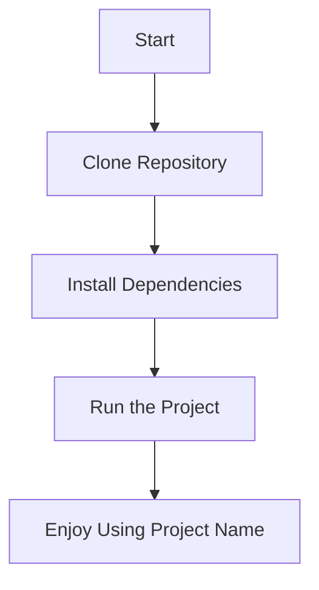

# 🌟 Project Name 🌟

Welcome to **Project Name**! This is a brief and engaging description of your project. Whether it's a tool, library, app, or something else, let users know what it does and why it's awesome.

---

## 🚀 Features

- **Feature 1**: A brief description of what this feature does.
- **Feature 2**: Another cool feature that users will love.
- **Feature 3**: Highlight a unique aspect of your project.
- **Feature 4**: Mention any integrations or compatibility with other tools.

---

## 📊 Visual Overview

### Features Table

| Feature           | Description                                |
|-------------------|--------------------------------------------|
| **Feature 1**     | A brief description of what this feature does. |
| **Feature 2**     | Another cool feature that users will love. |
| **Feature 3**     | Highlight a unique aspect of your project. |
| **Feature 4**     | Mention any integrations or compatibility. |

### Usage Flow Chart



---

## 📦 Installation

Getting started with **Project Name** is super easy! Follow these steps:

1. **Clone the repository**:
   ```bash
   git clone https://github.com/your-username/project-name.git
   ```

2. **Navigate to the project directory**:
   ```bash
   cd project-name
   ```

3. **Install dependencies**:
   ```bash
   npm install  # or yarn install, pip install, etc.
   ```

4. **Run the project**:
   ```bash
   npm start  # or yarn start, python main.py, etc.
   ```

---

## 🛠️ Usage

Here’s how you can use **Project Name**:

1. **Step 1**: Describe the first step to use your project.
2. **Step 2**: Provide a code snippet or example.
   ```javascript
   const project = require('project-name');
   project.doSomethingAwesome();
   ```
3. **Step 3**: Explain any additional steps or configurations.

---

## 🔄 Retry After Cloning

If you encounter issues after cloning the repository, follow these steps to troubleshoot:

1. **Ensure Dependencies Are Installed**: Make sure all dependencies are installed correctly. Run:
   ```bash
   npm install  # or yarn install, pip install, etc.
   ```

2. **Check for Missing Files**: Verify that all required files are present in the repository. If any files are missing, re-clone the repository:
   ```bash
   git clone https://github.com/your-username/project-name.git
   ```

3. **Check Environment Variables**: If your project requires environment variables, ensure they are set up correctly. Create a `.env` file if necessary:
   ```bash
   cp .env.example .env
   ```

4. **Run the Project**: After resolving the issues, try running the project again:
   ```bash
   npm start  # or yarn start, python main.py, etc.
   ```

5. **Check Logs**: If the project still doesn’t work, check the logs for any error messages and address them accordingly.

---

<!-- ## 📄 Documentation

For more detailed information, check out the documentation.

--- -->

## 🤝 Contributing

We welcome contributions from the community! Here’s how you can help:

1. Fork the repository.
2. Create a new branch:
   ```bash
   git checkout -b feature/YourFeatureName
   ```
3. Commit your changes:
   ```bash
   git commit -m 'Add some feature'
   ```
4. Push to the branch:
   ```bash
   git push origin feature/YourFeatureName
   ```
5. Open a pull request.

Please read our `CONTRIBUTING.md` for more details.

---

## 📜 License

This project is licensed under the MIT License - see the `LICENSE` file for details.

---

## 🙏 Acknowledgments

- **Inspiration**: Mention any projects or people that inspired you.
- **Libraries**: List any third-party libraries or tools you used.
- **Contributors**: Shout out to your contributors!

---

## 📧 Contact

Have questions or want to get in touch? Feel free to reach out:

- **Email**: your-email@example.com
- **Twitter**: [@yourhandle](https://twitter.com/yourhandle)
- **GitHub**: [your-username](https://github.com/your-username)

---

## 🌈 Thank You!

Thank you for checking out **Madhavansh Ayurveda**! We hope you find it useful and enjoy using it as much as we enjoyed building it. Happy coding! 🎉
